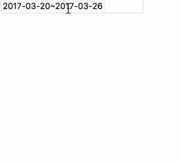

# calendar
a js calendar library, whick can pick day, week or month

## Preview

<p align="center">
    
</p>


## Installation

`npm install x-calendar --save`


## Usage
1. Import:
`import Calendar from 'x-calendar'`
or
`const Calendar = require('x-calendar')`

2. Initialize the calendar
`let calendar = new Calendar(el, options)`

-**el** always an **input** tag
-**options**

``` javascript
   options = {
      monthNames: ['Jan', 'Feb', 'Mar', 'Apr', 'May', 'Jun', 'Jul', 'Aug', 'Sep', 'Oct', 'Nov', 'Dec'],
      dayNames: ['Sun', 'Mon', 'Tue', 'Wed', 'Thu', 'Fri', 'Sat'],
      dayStart: 0,
      data: now,
      pickerCb () {},
      renderCb () {},
      type: 'day',
      selectMode: { type: ['day'] },
      disablePast: false,
      disableFuture: false,
      timePick: false,
      defaultFill: true,
      align: 'left',
      disableSelect: false
  }
```


